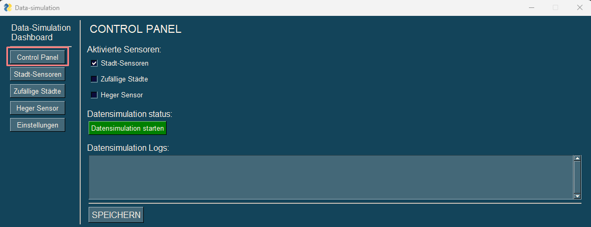
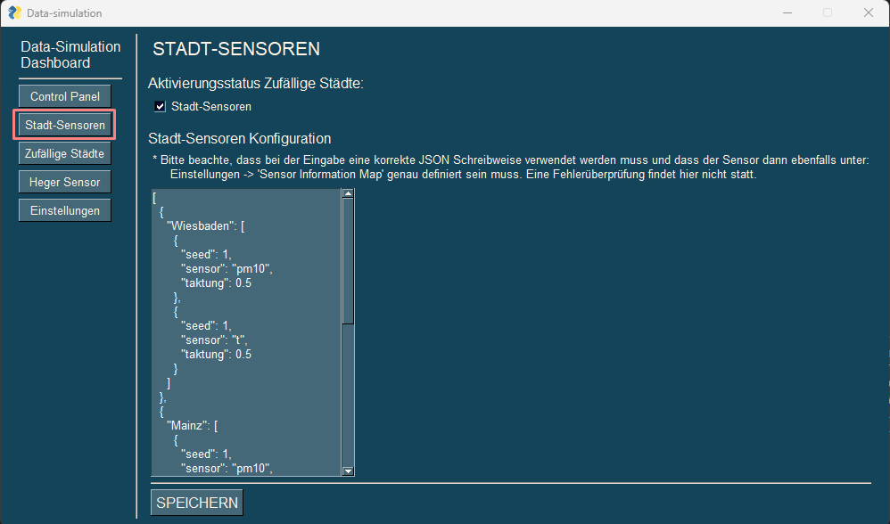
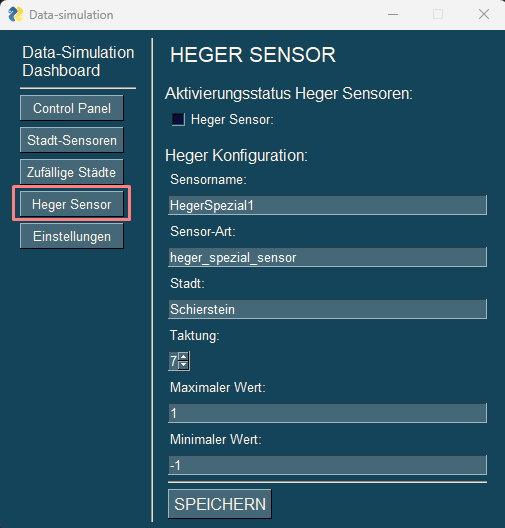
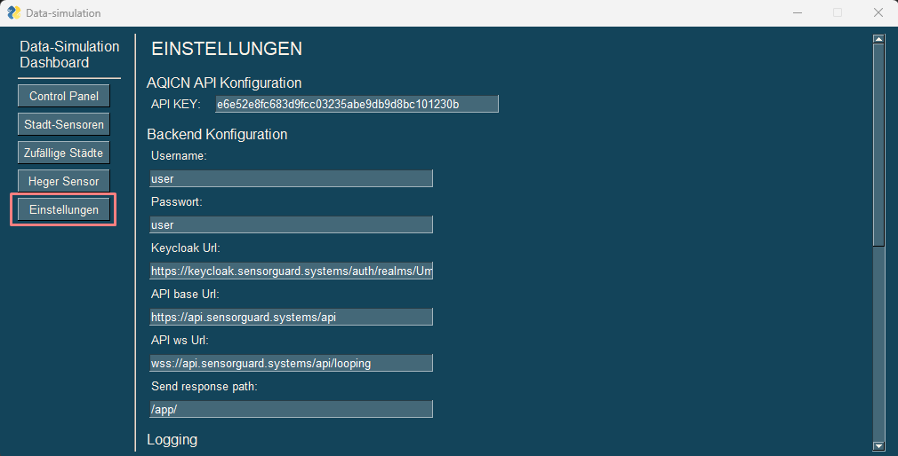
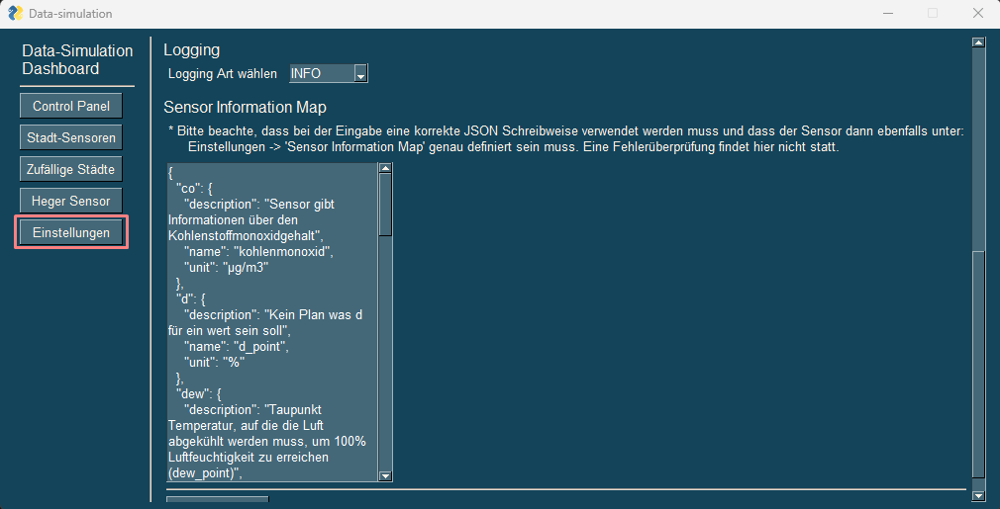
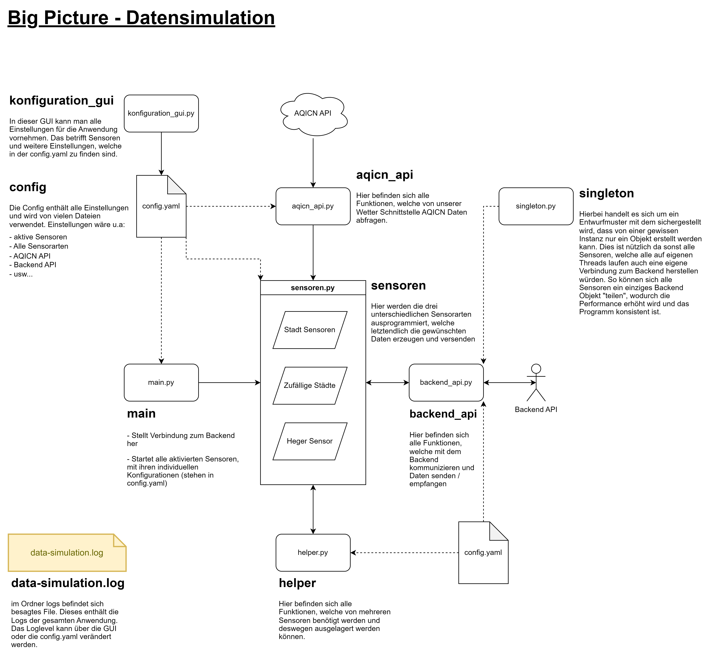

# Dokumentation - Datensimulation

## Anwender Dokumentation

### Allgemein

Im Folgenden wird die Datensimulation beschrieben. Diese kann unter anderem Wetterdaten aus verschiedenen Städten ausgeben. Das Programm lässt sich sowohl über eine GUI, als auch über das Terminal ausführen. Hier werden beide Methoden genau beschrieben. Da die Konfiguration über die GUI einfacher ist, dient diese als Leitfaden.

### Setup

Um die Datensimulation starten zu können, muss das Projekt zuerst aufgesetzt werden. Dafür geht man folgendermaßen vor:

1. [Python Version 11](https://www.python.org/downloads/) installieren
2. Das Repository von Github clonen
`git clone https://github.com/Umweltrechner-HSRM/data-simulation.git`
3. Die Datei `config.yaml.dist` in `config.yaml` umbenennen
4. Alle benötigten Module installieren. Hierfür muss man sich im Ordner `data-simulation` befinden und dort
`pip install -r requirements.txt` ausführen

### GUI starten

Um die grafische Oberfläche zu starten, muss lediglich die Datei `konfiguration_gui.py` aufgerufen werden, welche sich im `src` Ordner befindet. Dies geht mit folgendem Befehl `python ./src/konfiguration_gui.py`

### Control Panel

Das Control Panel lässt sich über den Reiter `Control Panel` erreichen und hat die Aufgabe, die Anwendung zentral zu steuern.



### Anwendung starten / stoppen

GUI:

> Unter der Überschrift `Datensimulation status` lässt sich die Anwendung starten / stoppen, indem man den Knopf `Anwendung starten` / `Anwendung stoppen` drückt.

Terminal:

> Hier muss die `main.py` ausgeführt werden, welche sich im `src` Ordner befindet. Der Befehl dazu lautet: `python ./src/main.py`. Die Anwendung läuft jetzt so lange weiter, bis ein Keyboard Interrupt ausgelöst wird, welches die Anwendung stoppt. Dies funktioniert in Windows mit der Tastenkombination `Strg + C`.

### Sensoren zentral aktivieren und deaktivieren

Es gibt drei unterschiedliche Sensorarten (Stadt-Sensoren, Zufällige Städte, Heger Sensor). Diese können zentral deaktiviert / aktiviert werden.

GUI:

> Unter der Überschrift `Aktivierte Sensoren` muss ein Haken in alle Felder gesetzt werden, die aktiv sein sollen. Danach muss auf Speichern geklickt werden, damit die Veränderungen übernommen werden (Dies ist bei allen weiteren Einstellungen ebenfalls der Fall und wird nicht noch einmal erwähnt)

Terminal:

> In der `config.yaml` kann man unter `aktive_sensoren` die einzelnen Sensorwerte auf true / false setzen.

### Logging

Wichtige Events, wie versendete Daten oder neu registrierte Sensordaten werden geloggt.

GUI:

> Unter `Datensimulation Logs` sollten die Logs angezeigt werden, sobald die Anwendung gestartet ist.

Terminal:

> Im Ordner `logs` befindet sich (nachdem das Programm gestartet wurde) eine Datei namens `data-simulation.log`, welche die logs des Programmdurchlaufs enthält.

### Stadt Sensoren

Die Stadt Sensoren lassen sich mit dem Reiter `Stadt-Sensoren` erreichen. Hier kann man explizit gewünschte Städte und ihre Sensoren festlegen, deren Daten empfangen werden sollen. Diese einzelnen Sensoren lassen sich weiter konfigurieren. Zum einen kann angegeben werden, in was für einem Sekundentakt Daten versendet werden sollen. Zum anderen besteht die Möglichkeit, einen Seed anzugeben, welcher künstliche Schwankungen bei den Werten erzeugt, indem eine Zahl in der Range -seed zu +seed gewählt und mit dem echten Wert verrechnet wird. Es gibt folgende mögliche Sesoren:

- PM25 (lungengängiger Feinstaub)
- PM10 (einatembarer Feinstaub)
- O3 (Ozon)
- NO2 (Stickstoffdioxid)
- SO2 (Schwefeldioxid)
- CO (Kohlenstoffmonoxid)
- t (Temperatur)
- p (Pressure/Luftdruck)
- h (humidity/Feuchtigkeit)
- w (Wind)
- wg (höchste Windgeschwindigkeit des Tages)
- dew (Taupunkt)

Je nachdem welche Stadt angeben wird kann die Vielfalt der Sensoren schwanken. So gibt es in Mainz z.B relativ wenig Daten, während man in Wiesbaden relativ vielegibt



### Stadt Sensor aktivieren / deaktivieren

Hier lässt sich der Sensor aktivieren und deaktivieren. Die Funktionsweise ist hierbei identisch mit dem vorherigen Block [Sensoren zentral aktivieren und deaktivieren](#sensoren-zentral-aktivieren-und-deaktivieren).

### Stadt mit Sensoren hinzufügen

GUI:

> Unter der Überschrift “Stadt-Sensoren Konfiguration” kann man in Json Syntax mehrere Städte einfügen. Die Stadt enthält dann eine Liste mit allen Sensoren, die später gesendet werden sollen. Dies wird an einem Beispiel ersichtlich:

```json
[
 {
   "Wiesbaden": [
   {
    "seed": 1,
    "sensor": "pm10",
    "taktung": 5,
   },
   {
    "seed": 3,
    "sensor": "t",
    "taktung": 10,
   }
  ]
 },
 {
   "Mainz": [
   {
    "seed": 1,
    "sensor": "t",
    "taktung": 5,
   }
  ]
 }
]
```

> Hier senden nun die Städte Wiesbaden und Mainz. In  Mainz sendet der Sensor t (Temperatur) und in Wiesbaden sendet der Sensor pm10 (einatembarer Feinstaub) und t. Hierbei ist zu beachten, dass der Sensor auf welchen verwiesen wird (in dem Beispiel wären das `pm10` und `t`) auch in der `Sensor Information Map` hinterlegt sein muss. Darauf wird bei den Einstellungen unter dem Punkt `Sensor Information Map` eingegangen.`

Terminal:

> In der `config.yaml` muss der Punkt `city_configuration` bearbeitet werden. Das Prinzip ist das gleiche, allerdings muss statt der Json Syntax eine yaml Syntax verwendet werden.

### Sensoren der Stadt konfigurieren (Seed und Taktung)

Die Sensoren einer Stadt können entkoppelt und individuell konfiguriert werden. Was Seed und Taktung machen, wurde bereits erklärt und wird nicht noch einmal erwähnt.

GUI:

> Hier müssen (wie im vorherigen Beispiel gezeigt) in Json die Attribute `seed` und `taktung` bearbeitet werden. Im vorherigen Beispiel hätte Wiesbaden einen t sensor, welcher alle 10 Sekunden Daten versendet und den versendeten Wert mit einem Seed von 3. Zusätzlich hat Wiesbaden den `pm10` Sensor, welcher alle 5 Sekunden Daten mit einem Seed von 1 versendet.

Terminal:

> Hier gilt dasselbe wie beim Punkt `Stadt mit Sensoren hinzufügen`.

### Zufällige Städte

Dieser Sensor lässt sich unter dem Reiter ‘Zufällige Städte’ erreichen. Der Sensor hat die Aufgabe, zufällig neue Städte zu finden und die Sensordaten der Stadt an das Backend zu schicken. Die Städte werden  hierbei aus einer Liste ausgewählt. Auch hier gibt es wieder Konfigurationsmöglichkeiten.


### Zufällige Städte aktivieren / deaktivieren

Hier lässt sich der Sensor aktivieren und deaktivieren. Die Funktionsweise ist hierbei identisch mit dem vorherigen Block `Sensoren zentral aktivieren und deaktivieren`.

### Zufällige Städte konfigurieren

Hier gibt es folgende Konfigurationsmöglichkeiten:

1. `Taktung`: wurde bereits zuvor erklärt
2. `Anzahl unterschiedlicher Städte`: sagt aus wie viele neue zufällige Städte erzeugt werden sollen
3. `Abstand zwischen den Starts der Städte`: Der Name spricht für sich
4. `Lebenszeit einer Stadt`: Die Stadt soll nach einem gewissen Zeitraum das versenden von Nachrichten beenden

GUI:

Alle eben genannte Attribute können unter dem Punkt `Zufällige Städte Konfiguration` angepasst werden.

Terminal:

In der `config.yaml` kann man den Punkt `random_citys_sensors` bearbeiten. Auch hier kann wieder das gleiche Prinzip angewandt werden. Die Attribute heißen zwar ein bisschen anders, werden aber aus dem Kontext ersichtlich.

### Neue potentielle zufällige Stadt hinzufügen

Aus dieser Liste werden neue Städte gewählt, die noch nicht im Backend registriert wurden. Diese Liste kann man folgendermaßen erweitern.

GUI:

> Unter dem Punkt: `Liste aller zufälligen Städte`wird die Stadt in die Liste eingefügt. Es kann sein, dass zu einer Stadt keine Sensordaten vorliegen. In diesem Fall kann die Stadt nicht aufgerufen werden.

Terminal:

> In der `config.yaml` kann man unter dem Punkt `random_citys` neue Städte in die Liste einfügen.

### Heger Sensor

Der Heger Sensor lässt sich unter dem Reiter `Heger Sensor` finden. Dieser soll sehr schnell wechselnde Sensordaten modellieren, um einen nahezu eckigen Graphen zu erzeugen. Auch hier lassen sich Konfigurationen vornehmen.



### Heger Sensor aktivieren / deaktivieren

Hier lässt sich der Sensor aktivieren und deaktivieren. Die Funktionsweise ist hierbei identisch mit dem vorherigen Block `Sensoren zentral aktivieren und deaktivieren`.

### Heger Sensor konfigurieren

Der Heger Sensor lässt sich folgendermaßen konfigurieren. Es muss ein min und max Wert angegeben werden, der gesendet wird. Über die Taktung (in Sekunden) wird die Intervalllänge festgelegt. Des Weiteren werden dem Sensor unter `Sensorname` ein Name und unter `Stadt` eine Stadt zugeteilt. Unter `Sensor-Art` muss auf einen Sensor verwiesen werden, welcher auch in der Sensor Information Map zu finden ist.

GUI:

> Alle oben genannten Werte können in der GUI unter dem Punkt `Heger Konfiguration` angepasst werden.

Terminal:

> In der `config.yaml` können die gleichen Konfigurationen unter dem Punkt `heger_spezial` verwendet werden. Die Namen sind nicht deckungsgleich, jedoch aus dem Kontext ersichtlich.

### Einstellungen

Hier können Einstellungen vorgenommen werden, welche die allgemeine Anwendung und nicht die Sensoren betreffen.




### AQICN API Konfiguration

Hier wird der Token zu der Wetter Schnittstelle von Aqicn abgelegt.

GUI:

> Unter `AQICN API Konfiguration` einen validen Token einfügen.

Terminal:

> In der `config.yaml` den Wert bei ‘aqicn_key’ anpassen.

### Backend Konfiguration

Hier wird die Konfiguration zum Backend geregelt. Es gibt folgende Attribute:

1. `Username`: Benutzername für Verifizierung
2. `Passwort`: Passwort für Verifizierung
3. `Keycloak Url`: Nötig zur Authentifizierung
4. `API base Url`: Basis Url, aus welcher später andere Url’s abgeleitet werden
5. `API ws Url`: Url zu dem Websocket an den gesendet wird
6. `Send response path`: Pfad an den Werte geschickt werden sollen

GUI:

> Alle diese Attribute lassen sich unter dem Punkt `Backend Konfiguration` anpassen.

Terminal:

> Die gleichen Konfigurationen lassen sich auch in der `config.yaml` unter dem Punkt `backend` vornehmen. Auch hier sind die Attributnamen nicht deckungsgleich, aber aus dem Kontext ersichtlich.

### Logging Konfiguration

Hier kann das Loglevel ausgewählt werden. Es gibt folgende Auswahlmöglichkeiten:

- `DEBUG`: Diese Ebene wird verwendet, um detaillierte Informationen über die internen Vorgänge der Anwendung bereitzustellen. Dies wird in der Regel zu Debugging-Zwecken verwendet.
- `INFO`: Diese Ebene wird verwendet, um Informationen über den normalen Betrieb der Anwendung bereitzustellen. Dies könnte Nachrichten umfassen, die anzeigen, dass eine bestimmte Funktion aufgerufen wurde oder ein bestimmter Codeabschnitt erreicht wurde.
- `WARNING`: Diese Ebene wird verwendet, um ein mögliches Problem anzuzeigen. Dies könnte Situationen umfassen, in denen eine Anwendung weiterhin ausgeführt wird, aber etwas Unerwartetes passiert ist.
- `ERROR`: Diese Ebene wird verwendet, um ein ernstes Problem anzuzeigen, das aufgetreten ist. Dies könnte Situationen umfassen, in denen die Anwendung eine bestimmte Operation nicht ausführen kann oder in denen eine Ausnahme ausgelöst wurde.
- `CRITICAL`: Diese Ebene wird verwendet, um ein kritisches Problem anzuzeigen, das aufgetreten ist. Dies könnte Situationen umfassen, in denen die Anwendung nicht mehr verwendbar ist oder in denen Daten verloren gegangen sind.

GUI:

> Unter dem Punkt `Logging` beim Dropdown das gewünschte Loglevel auswählen.

Terminal:

> In der `config.yaml` muss unter dem Punkt `log_level` das gewünschte Log-Level als String gesetzt werden.

### Sensor Information Map

In der Anwendung wird nicht mit vollständigen Sensornamen gearbeitet, stattdessen werden Abkürzungen verwendet. Diese verweisen auf die `Sensor Information Map`, welche hier genauer beschrieben wird.

GUI:

> Unter dem Punkt  `Sensor Information Map` lassen sich Einstellungen vornehmen. Dies wird am besten anhand eines Beispiels erklärt:

```json
{
  "co2": {   
    "description": "Informationen über Kohlenstoffmonoxidgehalt",
    "name": "kohlenmonoxid",
    "unit": "µg/m3"
 },
 "t": {   
    "description": "Informationen über die Temperatur",
    "name": "temperatur",
    "unit": "°C"
 }
}
```

> In diesem Beispiel wird die Abkürzung `co2`, genauer definiert. `description` wäre hierbei eine ausführliche Beschreibung `name`, der ausgeschriebene Name der Sensorart und `unit` die Messeinheit. Unter Beibehaltung der Syntax lassen sich so neue Sensoren hinzufügen und bestehende verändern.

Terminal:

> In der `config.yaml` kann man die gleichen Konfigurationen unter dem Punkt ‘sensor_details’ vornehmen. Allerdings ist hier wieder zu beachten, dass eine yaml statt einer json syntax verwendet werden muss.

## Technische Dokumentation

### Big Picture



Im Folgenden wird erklärt, wie das Skript auf der technischen Seite funktioniert. Dabei wird sich auf obige Abbildung bezogen. Im Wesentlichen besteht das Programm aus 8 Dateien. Das wären zum einen die `config.yaml`, das `data-simulation.log` im Ordner `logs` und den Python Dateien: `konfiguration_gui.py`, `main.py`, `sensoren.py`, `aqicn_api.py`, `backend_api.py`, `helper.py` und `sinleton.py`.
Gehen wir nun die gesamte Anwendung einmal logisch durch. Hierbei gehen wir nicht komplett in die Tiefe. Dafür muss man dann explizit in den Code gehen, welcher aber auch dokumentiert ist:

- Wenn man die `konfiguration_gui.py` aufruft, bekommt man eine grafische Oberfläche, mit der man alle Einstellungen an der Anwendung vornehmen kann. Unter der Haube wirkt sich das dann auf die `config.yaml` aus welcher alle Konfigurationen festgehalten sind. Alle Konfigurationsmöglichkeiten wurde bereits in der [Anwenderdokumentation](#anwender-dokumentation) genau beschrieben, weshalb darauf jetzt nicht mehr eingegangen wird. Für die technische Umsetzung der GUI wird das Modul PySimpleGUI genutzt. Hierzu werden zuerst für das statische Menü, das Control Panel, Stadt/Zufälligen/Herger-Sensoren und die Einstellungen Spalten mit ihren inneren Elementen angelegt. Danach werden diese Spalten in einem Layout angeordnet und festgelegt, welche Spalten sichtbar und welche unsichtbar sein sollen. Danach folgen einige Hilfsfunktionen, welche die Anwendung benötigt. Danach gibt es zu jeder Spalte eine Methode, welche die richtigen Daten aus der `config.yaml` in die Spalte lädt. Nun folgt die Logik des Programms. Diese stellt sicher, dass man zwischen den Spalten mit einem Knopfdruck wechseln kann, dass man Veränderungen speichern kann und diese anschließend direkt angezeigt werden und dass sich das Programm starten / stoppen lässt und beim laufenden Programm die Logs angezeigt werden. Zum starten und stoppen des Programms, wird hier die `main.py` in einem Subprocess gestartet bzw. der Subprocess gekillt.

- Alle im folgenden vorgestellten Python Dateien loggen in die Datei `data-simulation.log` im Ordner `logs`. Die einezelnen Loglevel und wie man diese anpassen kann, wurde bereits in der [Logging Konfiguration](#logging-konfiguration).

- Der erste Programmaufruf beginnt stets mit der `main.py`. Diese stellt eine Verbindung zum Backend her und schaut in der `config.yaml` nach allen Sensoren, welche aktiviert werden sollen. Diese werden dann in einem neuen Thread gestartet. Eine Besonderheit stellen hierbei die zufälligen Städte dar. Hier werden je nach Anzahl der unterschiedlichen Städte direkt mehrere Threads für jede Stadt gestartet. Die Idee hinter den Threads ist es eine echte Parallelisierung mehrerer Sensoren zu erzeuge, wie es auch im echte Leben der Fall wäre.

- Die Threads haben leider den Nachteil, dass sie alle eine eigene Verbindung zum Backend aufbauen würden, was insbesondere bei einer hohen Anzahl von Sensoren nicht performant wäre. Deswegen wird das Singleton Entwurfsmuster genutzt. Dieses stellt sicher, dass von einer gewissen Instanz nur ein Objekt erstellt werden kann. Dies ist nützlich, da sonst alle Sensoren, welche alle auf eigenen Threads laufen, auch eine eigene Verbindung zum Backend herstellen würden. So können sich alle Sensoren ein einziges Backend Objekt "teilen", wodurch die Performance erhöht wird und das Programm konsistent ist. Realisiert wird das in mit der Datei `singleton.py`

- Die drei unterschiedlichen Sensorarten werden in der Datei `sensoren.py` ausprogrammiert. Der Unterschied zwischen den drei Sensorarten wurde bereits bei [Stadt Sensoren](#stadt-sensoren), [Zufällige Städte](#zufällige-städte) und [Heger Sensor](#heger-sensor) erklärt. Hier wird jetzt beschrieben, wie das ganze auf der technischen Seite funktioniert. Alle Sensoren haben gemeinsam, dass sie erst überprüfen, ob der Sensor bereits im Backend gespeichert ist. Sollte dies nicht der Fall sein, wird der Sensor zuerst beim Backend registriert. Danach stellen alle Sensoren ein Ergebnis zusammen, welches anschließend an das Backend geschickt wird. Dieses Ergebnis ist bei allen Sensoren gleich aufgebaut. Genauer beschrieben wird dies im Anschluss unter [Sensor Namen und Daten Konventionen](#sensor-namen-und-daten-konventionen). Allerdings haben die drei Sensorarten unterschiedliche Wege, um an Ihre Daten zu gelangen.

  - Die `Stadt Sensoren` funktionieren, indem es für jeden einzelnen Sensor in einer Stadt einen Thread gibt. Jeder dieser Threads ruft dann von AQICN API die aktuellen Wetterdaten ab. Von der Schnittstelle erhält man als Antwort immer alle Sensoren. Ein Beispiel lässt sich unter [AQICN Response](#aqicn-response) finden. Der Thread filtert sich dann den einen Sensor Wert heraus den er repräsentieren soll.

  - Bei den `Zufälligen Städten` funktioniert dies ein klein wenig anders. Würde man hier die gleiche Logik verwenden, wie bei den `Stadt Sensoren`, würden zu viele Anfragen an die AQICN API gestellt werden. Ein Beispiel: Hätte man 100 zufällige Städte mit jeweils 10 Sensoren und jeder Sensor würde alle 10 Sekunden seine Daten verschicken. Dann wären das 6000 API Requests in einer Minute. Um diese Anzahl zu reduzieren, wird bei den zufälligen Städten der Ansatz verfolgt, dass es für jede Stadt einen Thread gibt und dieser eine Thread für alle Sensoren die Daten ausliest und verschickt. So lässt sich im obigen Beispiel die Anzahl von API Requests von 6000 API Requests in einer Minute auf 600 API Requests in einer Minute reduzieren.

  - Zu guter letzt gibt es noch den `Heger Sensor`, dieser bekommt einen min und einen max Wert vom Nutzer übergeben (steht in der `config.yaml`). Diese Werte sollen im Wechsel versendet werden. Deswegen sind hier die Timestamps die einzige interessante Berechnung. Diese Timestamps müssen nämlich möglichst nahe aneinander liegen, um später im Graph eine möglichst harte Kante zu erzeugen.

- Für die Kommunikation mit der Wetter-Schnittstelle ist die Datei `aqicn_api.py` verantwortlich. Neben einigen Hilfsfunktionen kann die Schnittstelle im Wesentlichen eine Liste von Wetterstation zu einer Stadt ausgeben und anhand dieser Wetterstationen kann man dann auch ihre zugehörigen Sensor Werte abfragen. Genauso ist es auch möglich, sich die Wetterdaten von einer Stadt zu holen. Hier kann sich jedoch die Anzahl von Sensoren unterscheiden, weshalb ich diese Möglichkeit nicht optimal fand. Die Hilfsfunktionen dienen dazu, um zu schauen, ob es für eine Stadt Wetterstationen gibt und um für eine Stadt genau die Wetterstation zu finden, welche am meisten Sensoren hat und um zu schauen über welche Sensoren eine Wetterstation verfügt.

- Für die Kommunikation mit dem Backend ist die Datei `backend_api.py` verantwortlich. Hier wird auch der bereits zuvor beschriebene Singleton Ansatz verwendet. Alle möglichen Einstellungsmöglichkeiten lassen sich auch hier wieder in der `config.yaml` verändern und wurde bereits bei [Backend Konfiguration](#backend-konfiguration) beschrieben. Hier gibt es zwei Hauptaufgaben:

  - Setup: Hier wird zum einen die Verbidnung zum Websocket hergestellt, an welchen später die Daten gesendet werden und zum anderen wird auch die Verbindung zu der REST Schnittstelle hergestellt. Um mit dieser kommunizieren zu können, benötigt man einen Token. Um diesen zu erhalten, nutzen wir Keycloak. Dort muss man sich mit Nutzername und Passwort authentifizieren, um einen gültigen Token zu erhalten.

  - Get Requests: Hier kann man alle Städte und Sensoren abfragen, welche bereits im Backend registriert sind

  - Post Requests: Hier kann man zu einem neuen Sensoren in der Datenbank registrieren und zum anderen Sensordaten an das Backend schicken.

- In der `helper.py` befinden sich alle Funktionen, welche von den anderen Systemen genutzt werden, aber sich nicht klar einer bestimmten Funktion zuordnen lassen. Dazu zählen zum Beispiel das Logging aufzusetzen. Der Zugriff auf die config und das generieren der Standartantwort der Sensoren

### Sensor Namen und Daten Konventionen

Die Namen der verwendeten Daten haben folgenden Aufbau: `<Stadt_Sensorart_UmweltstationID>`
Die an das Backend versendeten Daten sehen dann folgendermaßen aus:

```json
{
  "id": "Wiesbaden_temperatur_10869",
  "timestamp": 1675242191733.671,
  "value": 3.5, 
  "city": "Wiesbaden"
}
```

- `ìd`: hieran lässt sich der Sensor eindeutig identifizieren
- `timestamp`: Das ist der Zeitpunkt an dem der Wert erzeugt wurde. Hierbei handelt es sich um einen UNIX Timestamp
- `value`: Wert des Sensors
- `city`: Die Stadt aus der die Daten stammen

### AQICN Response

Die Schnittstelle von der wir unsere Daten beziehen heißt `AQICN API``. [Hier](https://aqicn.org/city/germany/hesse/wiesbaden-schiersteiner-str./) kommt man zu deren Website. [Hier](https://aqicn.org/api/de/) kommt man zu der allgemeinen Schnittstellenbeschreibung und [hier](https://aqicn.org/json-api/doc/) zu der Json Beschreibung.
Eine klassische Antwort der AQICN API, aus welcher wir die Daten für das Backend beziehen sieht folgendermaßen aus:

```json
{
  "status": "ok",
  "data": {
      "aqi": 73,
      "idx": 10850,
      "attributions": [
          {
              "url": "https://www.hlnug.de/",
              "name": "Hessian State Office for Nature Conservation, Environment and Geology - (Hessisches Landesamt für Naturschutz, Umwelt und Geologie)",
              "logo": "Germany-Hesse.png"
          },
          {
              "url": "https://waqi.info/",
              "name": "World Air Quality Index Project"
          }
      ],
      "city": {
          "geo": [
              50.078333333333,
              8.2313888888889
          ],
          "name": "Wiesbaden-Ringkirche, Germany",
          "url": "https://aqicn.org/city/germany/hesse/wiesbaden-ringkirche",
          "location": ""
      },
      "dominentpol": "pm25",
      "iaqi": {
          "co": {
              "v": 0.1
          },
          "h": {
              "v": 61
          },
          "no2": {
              "v": 19.2
          },
          "o3": {
              "v": 17.4
          },
          "p": {
              "v": 1027.9
          },
          "pm10": {
              "v": 22
          },
          "pm25": {
              "v": 73
          },
          "so2": {
              "v": 0.5
          },
          "t": {
              "v": 6.8
          },
          "w": {
              "v": 2.2
          }
      },
      "time": {
          "s": "2023-03-03 12:00:00",
          "tz": "+01:00",
          "v": 1677844800,
          "iso": "2023-03-03T12:00:00+01:00"
      },
      "forecast": {
          "daily": {
              "o3": [
                  {
                      "avg": 20,
                      "day": "2023-03-03",
                      "max": 33,
                      "min": 14
                  },
                  {
                      "avg": 26,
                      "day": "2023-03-04",
                      "max": 30,
                      "min": 19
                  },
                  {
                      "avg": 25,
                      "day": "2023-03-05",
                      "max": 32,
                      "min": 17
                  },
                  {
                      "avg": 18,
                      "day": "2023-03-06",
                      "max": 32,
                      "min": 13
                  },
                  {
                      "avg": 19,
                      "day": "2023-03-07",
                      "max": 21,
                      "min": 19
                  }
              ],
              "pm10": [
                  {
                      "avg": 18,
                      "day": "2023-03-03",
                      "max": 24,
                      "min": 12
                  },
                  {
                      "avg": 15,
                      "day": "2023-03-04",
                      "max": 25,
                      "min": 12
                  },
                  {
                      "avg": 12,
                      "day": "2023-03-05",
                      "max": 16,
                      "min": 7
                  },
                  {
                      "avg": 17,
                      "day": "2023-03-06",
                      "max": 28,
                      "min": 9
                  },
                  {
                      "avg": 14,
                      "day": "2023-03-07",
                      "max": 14,
                      "min": 12
                  }
              ],
              "pm25": [
                  {
                      "avg": 61,
                      "day": "2023-03-03",
                      "max": 73,
                      "min": 43
                  },
                  {
                      "avg": 42,
                      "day": "2023-03-04",
                      "max": 68,
                      "min": 32
                  },
                  {
                      "avg": 37,
                      "day": "2023-03-05",
                      "max": 52,
                      "min": 23
                  },
                  {
                      "avg": 57,
                      "day": "2023-03-06",
                      "max": 76,
                      "min": 27
                  },
                  {
                      "avg": 54,
                      "day": "2023-03-07",
                      "max": 54,
                      "min": 47
                  }
              ]
          }
      },
      "debug": {
          "sync": "2023-03-03T21:59:06+09:00"
      }
  }
}
```

### Helper Scripts

Unter dem Ordner `helper_scripts` lässt sich die Datei `get_citys_with_sensors.py` finden. Diese Hilfsfunktion kann aus einer Liste von vielen Städten diejenigen heraus filtern, für welche es Sensordaten gibt. Die Liste der Städte, welche kontrolliert werden soll befindet sich im Ordner `data` und heißt `liste_aller_städte.json`. Die gefilterten Städte werden dann im selben Ordner unter dem Namen `city_sensor_map.json` gespeichert. Das Skript lässt sich dann mit folgendem Befehl ausführen:

```shell
python ./helper_scripts/get_citys_with_sensors.py
```
